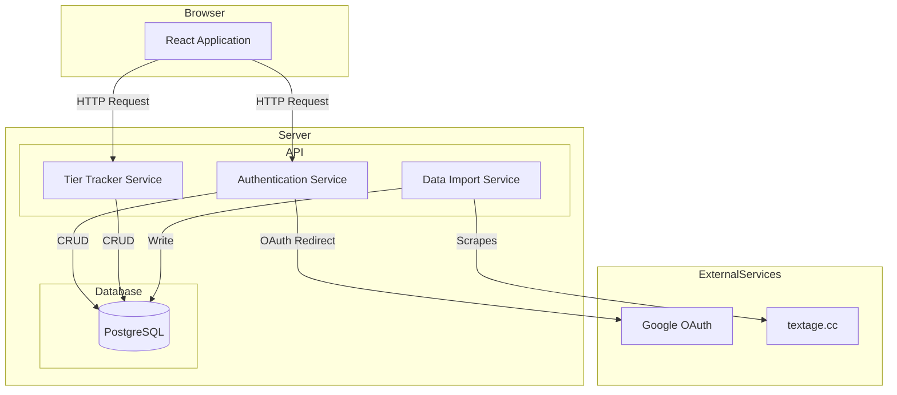
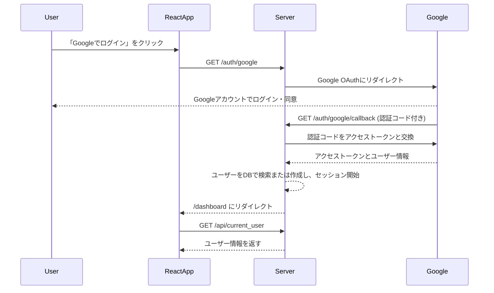

# 技術設計書

---
**目的**: このドキュメントは、複数の実装者間での一貫性を確保し、解釈のずれを防ぐために十分な詳細を提供します。

**アプローチ**:
- 実装の意思決定に直接影響する重要なセクションを含みます。
- 実装エラーを防ぐために重要でない限り、オプションのセクションは省略します。
- 機能の複雑さに応じて詳細レベルを調整します。
- 長い文章よりも図や表を優先します。
---

## 概要
**目的**: この機能は、beatmania IIDXプレイヤーに、自身のクリア状況を追跡し、成長を可視化するためのウェブアプリケーションを提供します。
**ユーザー**: 主にbeatmania IIDXの熱心なプレイヤーが、自身のクリアランプを管理し、難易度表と比較するために使用します。
**インパクト**: ユーザーは、これまでローカルのメモや記憶に頼っていたクリア状況を、ウェブ上で一元管理できるようになります。

### 目標
- ユーザー認証機能を提供し、個人のデータを安全に管理する。
- 楽曲データを表示し、クリア状況を簡単に更新できるUIを提供する。
- クリア状況に基づいた基本的な統計情報を提供する。

### 非目標
- リアルタイムでのスコア反映。
- 複数人でのデータ共有やソーシャル機能。
- IIDX以外の音楽ゲームのサポート。

## アーキテクチャ

> 詳細な調査メモは `research.md` を参照してください。この設計書はレビュー担当者向けに自己完結している必要があり、すべての決定事項と契約をここに記載します。

### アーキテクチャパターンと境界マップ
**選択パターン**: シンプルなWebアプリケーションのため、モノリシックなフルスタックアーキテクチャを採用します。Node.js/ExpressサーバーがAPIとReactの静的ファイルの両方を提供します。



**アーキテクチャ統合**:
- **選択パターン**: モノリシック・フルスタック・アプリケーション。単一のNode.js/ExpressサーバーがAPIとReactフロントエンドの両方を提供します。理由は`research.md`に詳述。
- **ドメイン/機能境界**:
    - **AuthService**: ユーザー認証とセッション管理を担当。
    - **TierTrackerService**: 楽曲データ、クリアランプの管理、統計機能のコアロジックを担当。
    - **DataImportService**: `textage.cc`から楽曲データをスクレイピングし、データベースを更新する手動実行のサービス。
- **ステアリング準拠**: プロジェクトのステアリングファイルが存在しないため、一般的なベストプラクティスに従います。

### 技術スタック

| Layer | Choice / Version | Role in Feature | Notes |
|---|---|---|---|
| Frontend / CLI | React 18+, Vite | 動的なユーザーインターフェースを構築 | `create-react-app`よりも高速なビルドと開発サーバー |
| Backend / Services | Node.js 20+, Express 4 | アプリケーションのコアロジックとAPIを提供 | 長期サポート(LTS)バージョンを使用 |
| Data / Storage | PostgreSQL 15+ | 永続的なデータ（ユーザー、楽曲、クリアランプ）を保存 | 信頼性の高いリレーショナルDB |
| Messaging / Events | (なし) | | 現時点では非同期メッセージングは不要 |
| Infrastructure / Runtime | Docker | 開発環境と本番環境の一貫性を確保 | `docker-compose`でDBとサーバーを管理 |

## システムフロー

### ユーザー認証フロー (Google OAuth)


## 要求トレーサビリティ

| Requirement | Summary | Components |
|---|---|---|
| 1.x | ユーザー認証 | `AuthService`, `User`, `LoginButton` |
| 2.x | 難易度表の表示 | `TierTrackerService`, `MusicTable`, `FilterControls` |
| 3.x | クリアランプ管理 | `TierTrackerService`, `LampSelector` |
| 4.x | データ永続化 | `PostgreSQL`, all services |
| 5.x | 統計機能 | `TierTrackerService`, `StatsDashboard`, `ContributionCalendar` |

## コンポーネントとインターフェース

### Frontend

#### `LoginButton`
- **Intent**: Googleログインを開始するためのUIコンポーネント。
- **Requirements**: 1.2
- **Responsibilities**: クリックされたら、バックエンドの `/auth/google` エンドポイントにリダイレクトする。

#### `MusicTable`
- **Intent**: 楽曲の難易度表を表示する。
- **Requirements**: 2.1, 2.2, 2.3
- **Dependencies**: `TierTrackerService` (Outbound)
- **State Management**: 表示する楽曲リスト、フィルター条件、ソート順を管理。
- **Service Interface**:
  ```typescript
  interface MusicTableProps {
    songs: Song[];
    userLamps: UserLamp[];
  }
  ```

#### `LampSelector`
- **Intent**: ユーザーが楽曲のクリアランプを更新するためのUI。
- **Requirements**: 3.1, 3.2
- **Dependencies**: `TierTrackerService` (Outbound)
- **Service Interface**:
  ```typescript
  interface LampSelectorProps {
    songId: number;
    currentLamp: LampState;
    onUpdate: (songId: number, newLamp: LampState) => Promise<void>;
  }
  
  type LampState = 'NO PLAY' | 'FAILED' | 'ASSIST CLEAR' | 'EASY CLEAR' | 'CLEAR' | 'HARD' | 'EX-HARD' | 'FULLCOMBO';
  ```

#### `ContributionCalendar`
- **Intent**: GitHubのコントリビューションカレンダーのように、クリアランプの更新履歴を可視化する。
- **Requirements**: 5.0
- **Dependencies**: `TierTrackerService` (Outbound)
- **Service Interface**:
  ```typescript
  interface ContributionCalendarProps {
    lampHistory: Array<{ date: string; count: number }>;
  }
  ```

### Backend

#### `AuthService`
- **Intent**: ユーザー認証（Google OAuth）とセッション管理を担当。
- **Requirements**: 1.x
- **Dependencies**: `passport`, `passport-google-oauth20`, `express-session`, `PostgreSQL` (Outbound)
- **API Contract**:
  | Method | Endpoint | Request | Response | Notes |
  |---|---|---|---|---|
  | GET | /auth/google | (なし) | Redirect | Google OAuthフローを開始 |
  | GET | /auth/google/callback | (Googleからのコールバック) | Redirect | 認証成功後、フロントエンドにリダイレクト |
  | GET | /api/logout | (なし) | 200 OK | ユーザーセッションを破棄 |
  | GET | /api/current_user | (なし) | User | 現在のセッションのユーザー情報を返す |

#### `TierTrackerService`
- **Intent**: 楽曲、クリアランプ、統計に関するビジネスロジックを処理する。
- **Requirements**: 2.x, 3.x, 5.x
- **Dependencies**: `PostgreSQL` (Outbound)
- **API Contract**:
  | Method | Endpoint | Request | Response | Notes |
  |---|---|---|---|---|
  | GET | /api/songs | `{ level: number }` | `Song[]` | 指定されたレベルの楽曲リストを取得 |
  | GET | /api/lamps | | `UserLamp[]` | ログインユーザーのすべてのランプ情報を取得 |
  | PUT | /api/lamps | `{ songId: number, lamp: LampState }` | `UserLamp` | ランプ情報を更新 |
  | GET | /api/stats/history | | `Contribution[]` | ランプ更新履歴を取得 |

#### `DataImportService`
- **Intent**: `textage.cc` から楽曲データをスクレイピングする手動実行のスクリプト。
- **Requirements**: 2.0
- **Dependencies**: `axios`, `cheerio`, `PostgreSQL` (Outbound)
- **Batch / Job Contract**:
  - **Trigger**: 手動でのコマンドライン実行 (`npm run scrape`など)。
  - **Input**: `textage.cc` のHTML。
  - **Output**: データベースの `songs` テーブルを更新または新規作成。
  - **Idempotency**: スクリプトは既存の楽曲を重複して作成しないように、楽曲の一意なキー（例：曲名と譜面種別）で存在をチェックする必要がある。

## データモデル

### ドメインモデル
- **User**: アプリケーションのユーザー。Googleのプロフィール情報と関連付けられる。
- **Song**: 楽曲情報（タイトル、ジャンル、アーティスト、レベル、譜面種別）。
- **Lamp**: ユーザーの特定の楽曲に対するクリア状況（ランプ状態、更新日時）。

### 論理データモデル (PostgreSQL)

**`users` Table**
- `id`: `SERIAL PRIMARY KEY`
- `google_id`: `VARCHAR(255) UNIQUE NOT NULL`
- `display_name`: `VARCHAR(255)`
- `email`: `VARCHAR(255) UNIQUE`
- `created_at`: `TIMESTAMPTZ DEFAULT NOW()`

**`songs` Table**
- `id`: `SERIAL PRIMARY KEY`
- `title`: `VARCHAR(255) NOT NULL`
- `genre`: `VARCHAR(255)`
- `artist`: `VARCHAR(255)`
- `version`: `INT NOT NULL`
- `level`: `INT NOT NULL`
- `difficulty`: `VARCHAR(10) NOT NULL` (e.g., 'NORMAL', 'HYPER', 'ANOTHER')
- `UNIQUE (title, difficulty)`

**`user_lamps` Table**
- `id`: `SERIAL PRIMARY KEY`
- `user_id`: `INT REFERENCES users(id) ON DELETE CASCADE`
- `song_id`: `INT REFERENCES songs(id) ON DELETE CASCADE`
- `lamp`: `VARCHAR(20) NOT NULL`
- `updated_at`: `TIMESTAMPTZ DEFAULT NOW()`
- `UNIQUE (user_id, song_id)`

**`lamp_history` Table**
- `id`: `SERIAL PRIMARY KEY`
- `user_lamp_id`: `INT REFERENCES user_lamps(id) ON DELETE CASCADE`
- `lamp`: `VARCHAR(20) NOT NULL`
- `created_at`: `TIMESTAMPTZ DEFAULT NOW()`

## テスト戦略
- **単体テスト**:
  - `AuthService` のユーザー検索・作成ロジック。
  - `TierTrackerService` の統計計算ロジック。
  - スクレイピングスクリプトのHTML解析部分。
- **結合テスト**:
  - APIエンドポイントのテスト（リクエストとレスポンスの検証）。
  - `TierTrackerService` とデータベース間のやり取り。
- **E2Eテスト**:
  - ユーザーがログインし、ランプを更新し、統計ページで結果を確認する一連の流れ。

## オプションのセクション

### セキュリティに関する考慮事項
- すべてのAPIエンドポイントで認証を必須とし、ユーザーが自分のデータにのみアクセスできるようにする。
- `express-session` のセキュアな設定（`secure: true` in production, `httpOnly: true`）を使用する。
- スクレイピングは、対象サイトに過度な負荷をかけないように、適度な間隔をあけて実行する。
- IST連携は、ユーザーの認証情報をサーバーに保存する必要がある可能性が高く、セキュリティリスクが大きいため、初期リリースでは実装しない。
